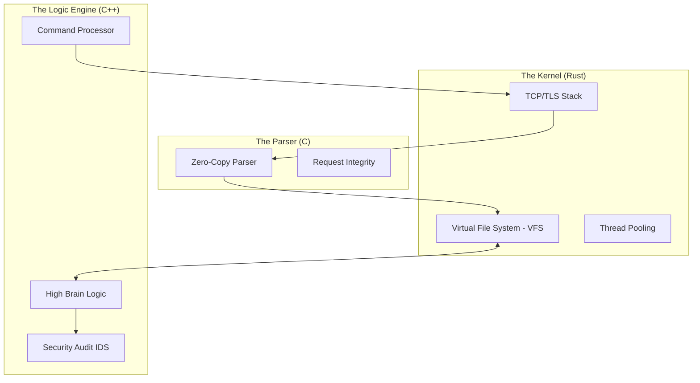

# Expresso OS: The Hybrid Systems-Kernel & Backend Framework

> **A First-Principles Masterpiece in Triple-Language Hybrid Engineering.**
> Built for High-Performance Networking, Real-Time Auditing, and Zero-Trust Remote Administration.

---

## The Hybrid Architecture: "Triple-Threat" Design

Expresso OS is not a traditional web server. It is a **Systems Hybrid Engine** that orchestrates three distinct software layers to achieve a balance of safety, performance, and logical complexity.



### 1. The Rust Kernel (Memory Safety)
Manages the bedrock of the system:
- **Asynchronous Networking**: High-concurrency socket handling.
- **VFS (Virtual File System)**: Abstracted file access with granular permissioning.
- **FFI Bridge**: Orchestrates the interaction between the C Parser and C++ Logic Engine.

### 2. 💎 The C++ Logic Engine (High Brain)
The "High Brain" of Expresso OS:
- **Real-Time Security Audit**: Every request is intercepted by the IDS (Intrusion Detection System).
- **Complex Command Routing**: Handles over 50+ Linux-like administrative commands.
- **System Memory Management**: Fine-grained control over internal state and performance metrics.

### 3. 🔌 The C Parser (Raw Power)
The performance bottleneck is eliminated by:
- **Zero-Copy Parsing**: Direct pointer-based manipulation of request buffers.
- **Lowest Latency**: Minimal overhead in the critical path of every request.

---

## The Terminal Interface

Expresso OS bypasses standard UI paradigms in favor of a **Command-Line Interface (CLI) Terminal**.

### Primary Capabilities:
- **50+ Integrated Commands**: Native implementations of `ls`, `cat`, `mkdir`, `top`, `ps`, and `nano`.
- **System Auditing**: Every command execution triggers a blue `[SYSTEM]` audit log from the C++ Logic Engine.
- **Remote Administration**: Perform deep system checks, file manipulations, and logic auditing from anywhere.
- **Embedded Editor**: A high-fidelity in-browser `nano` instance for real-time file tree modification.

---

## Rapid Deployment & Integration

Expresso OS is designed for modern containerized environments.

### Container Orchestration
Launch the full stack including the **Nginx Reverse Proxy**.
```bash
docker compose up --build
```

## API & Systems Reference

| Component | Responsibility | Performance Target |
| :--- | :--- | :--- |
| **Networking** | Rust `std::net` | Sub-millisecond latency |
| **Parsing** | C Pointer-logic | O(1) Header Access |
| **Logic** | C++ Logic Engine | Real-time Audit < 10µs |

---

## Principles
Built with ❤️ for Systems Engineering and First-Principles Design.  
Distributed under the **MIT License**.
